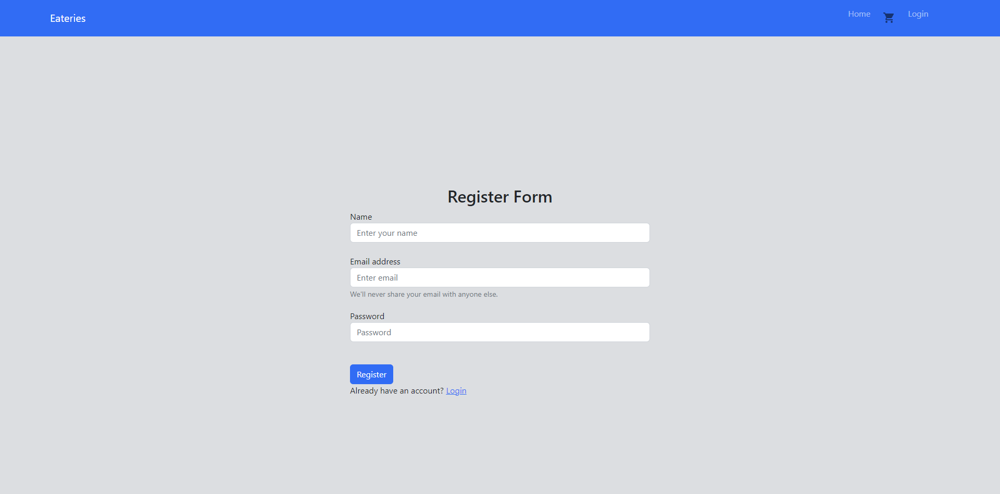

# eateries
Eateries Project containint both backend and front end

! Front end is wrritten in react using frameworks like materials ui , bootstrap and also some native css and html

! backend uses Express to handle requests, Node to run server, MongoDB to store data

! photos

!! Login page photo: 

!! Register page photo 

!! Home page photo

!! Cart page photo

